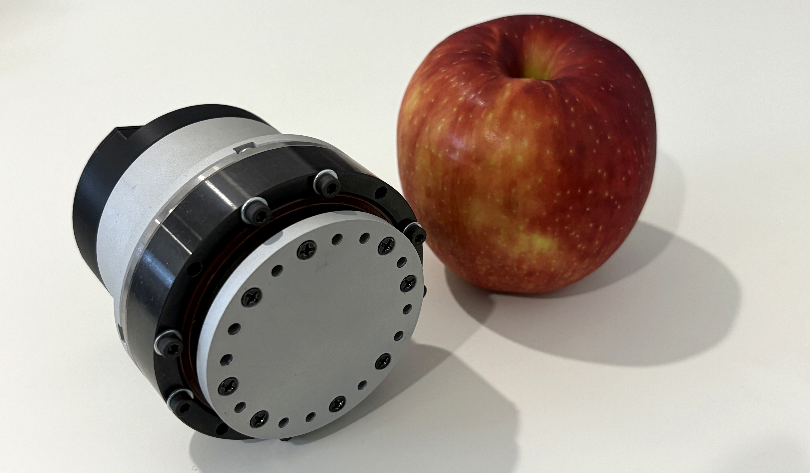
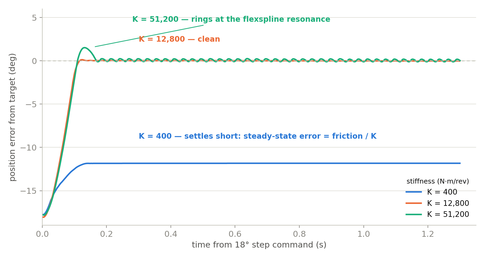
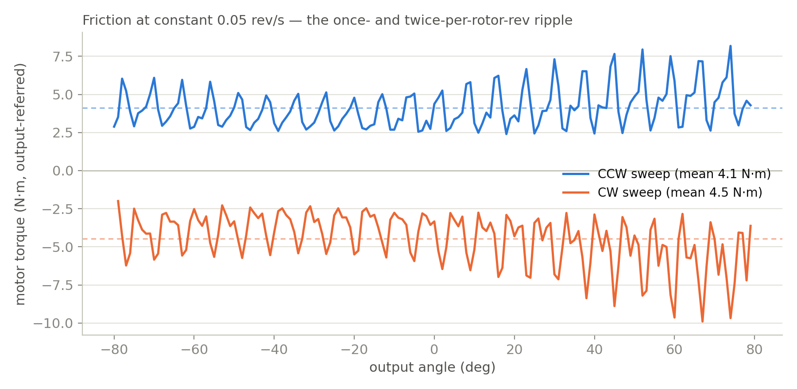
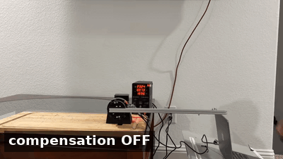
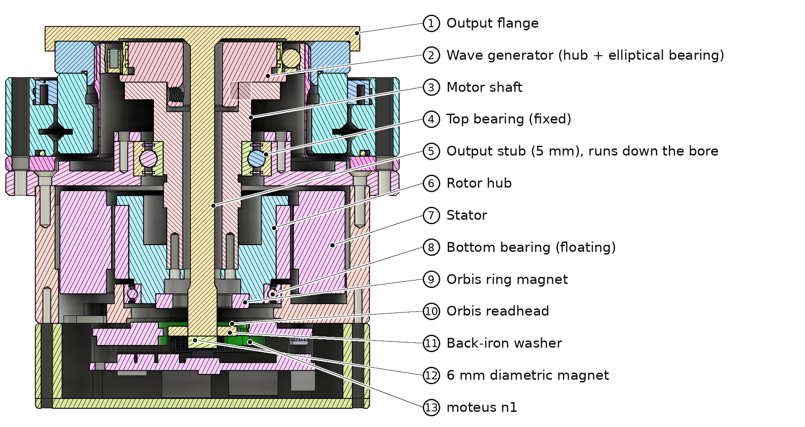

# Harmonic drive actuator

A 50:1 strain wave actuator built around a $100 ZXF17 gearbox off AliExpress,
a frameless motor, and two absolute encoders. Everything except the gearbox,
the motor and the controller was designed and machined for this build.

This repo is the control and test code, plus the data behind every number in
the writeup. The build itself is written up here:
[An actuator that nobody designs](https://medium.com/@harishpravin/an-actuator-that-nobody-designs-c571e692ce58?sharedUserId=harishpravin).



|  |  |
|---|---|
| Reduction | 50:1, single stage (ZXF17-50 strain wave) |
| Rated / peak torque | 21 N·m / 44 N·m |
| Envelope | ⌀80 mm × 78 mm, 991 g |
| Motor | CubeMars RI60 frameless inrunner, 14 pole pairs |
| Controller | moteus n1, FOC over CAN-FD |
| Input position | RLS Orbis BR10 ring encoder, 14-bit absolute, BiSS-C |
| Output position | AS5047P, 14-bit absolute, on-axis through the 8 mm bore |

## What it actually measures

All of these come from the final build, and every one of them traces back to a
CSV in `data/`.

| | |
|---|---|
| Speed range | 0.02 to 0.40 output rev/s (7 to 144 deg/s) |
| Kinetic friction | 4.1 to 4.4 N·m at 0.05 rev/s, +15% warm |
| Breakaway | ~10 N·m from rest |
| Dead band | 5 to 7 N·m at the output |
| Max clean stiffness | 12,800 N·m/rev. Rings at 25,600, badly at 51,200 |
| Control loop | 0.91 ms mean, 1.84 ms at p99, Python over CAN-FD |
| Efficiency | ~0.6 at 21% load, gravity-dyno referenced |



Step responses as stiffness climbs. The response stays clean to 12,800 N·m/rev,
first rings at 25,600, and rings clearly at 51,200. This is the raw impedance
controller with no friction compensation, which is why the soft spring settles
short of its target.

The stiffness ceiling is mechanical, not computational. The Colgate-Hogan
passivity bound for that loop rate sits about 10x higher than where the thing
actually started ringing, because the flexspline's own torsional resonance
binds first. A faster control computer would not help.



This plots friction against rotor angle in both directions. The once-per-rev
hump is eccentricity from a three-part input stack; the twice-per-rev ripple on top of
it is the wave generator's two ellipse lobes. `control/backdrive.py` cancels
both, plus the detent field underneath them.



The first half is backdriving by hand with compensation off, and the second
half has it on.

## Layout



```
actuator/       shared library: link, registers, safety limits, csv, plotting
bringup/        first power-on, magnet check, gain sweep, basic moves, run-in
characterize/   speed sweep, friction map, breakaway, stiffness ladder, lever torque
control/        impedance control and virtual backdriving
analysis/       the plotting script behind the writeup figure
config/         moteus config snapshots and the fitted friction map
data/           the CSVs behind the figures
cad/            STEP exports, as built and the revision before it
media/          the images used in this README
```

Anything two scripts both needed lives in `actuator/`. Everything else is one
file per experiment, and each file's docstring says what it is for, how to run
it, and what it is safe to run it against.

## Running it

```
pip install -e .
```

Then run from the repo root, since the scripts write their logs to `data/`:

```
python3 characterize/speed_sweep.py --dry-run
```

`--dry-run` connects, reads telemetry and commands no motion. Do it first.
It also checks that the query reply fits in one CAN-FD frame, which is the
failure mode that silently truncates the FAULT register and blinds every
safety check downstream.

Order I actually ran things in, on a new build:

1. `bringup/magnet_check.py` before assembly, with the output free to turn
2. `bringup/first_power_on.py` at low torque, one speed
3. `bringup/gain_sweep.py` to find kp, then `bringup/run_in.py`
4. `characterize/speed_sweep.py`, `breakaway_ramp.py`, `friction_sweep.py`
5. `characterize/lever_test.py` for real output torque against a scale
6. `characterize/impedance_sweep.py` for the stiffness ceiling
7. `control/impedance.py`, then `control/backdrive.py`

Read `GOTCHAS.md` before step 2. It is the list of things that cost me days.

## Safety

Every script calls `check_limits()` on every sample and stops the motor if it
raises. Limits are set well inside the hardware ratings on purpose. The abort
thresholds live in one place, `actuator/safety.py`, so they cannot drift apart
between scripts.

The gearbox is the fragile part, not the motor. Torque caps in these scripts
are output-referred and conservative.

## Thanks

JLCCNC and EasyEDA machined every custom part, RLS supplied the Orbis encoder,
mjbots the moteus n1 controller, and CubeMars the RI60 frameless motor. This
build does not happen without them.


MIT licensed, see LICENSE.

